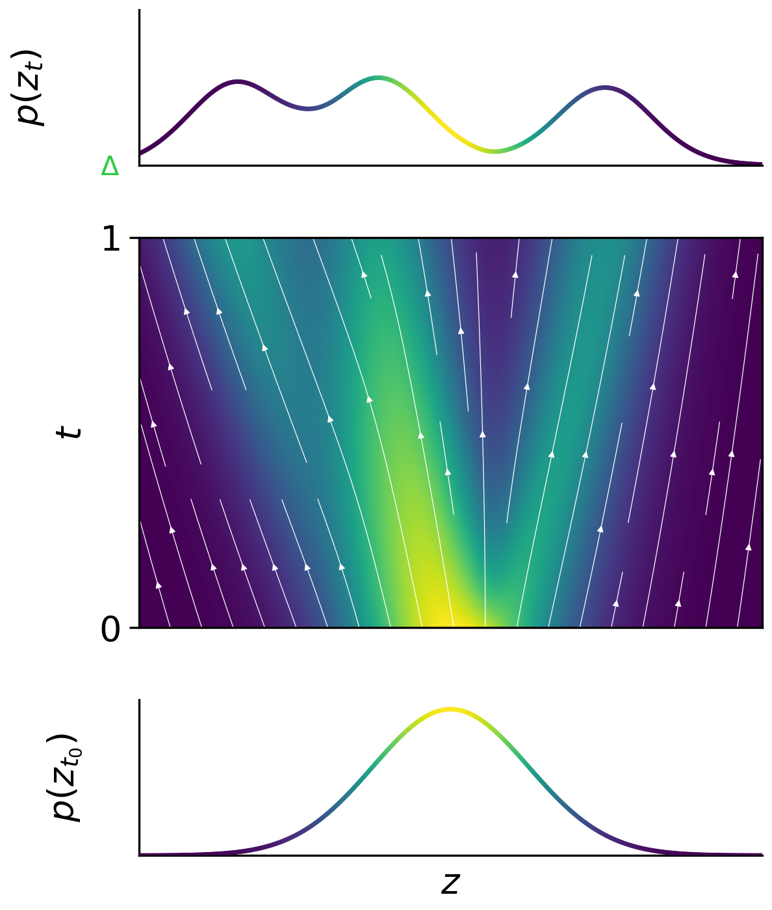
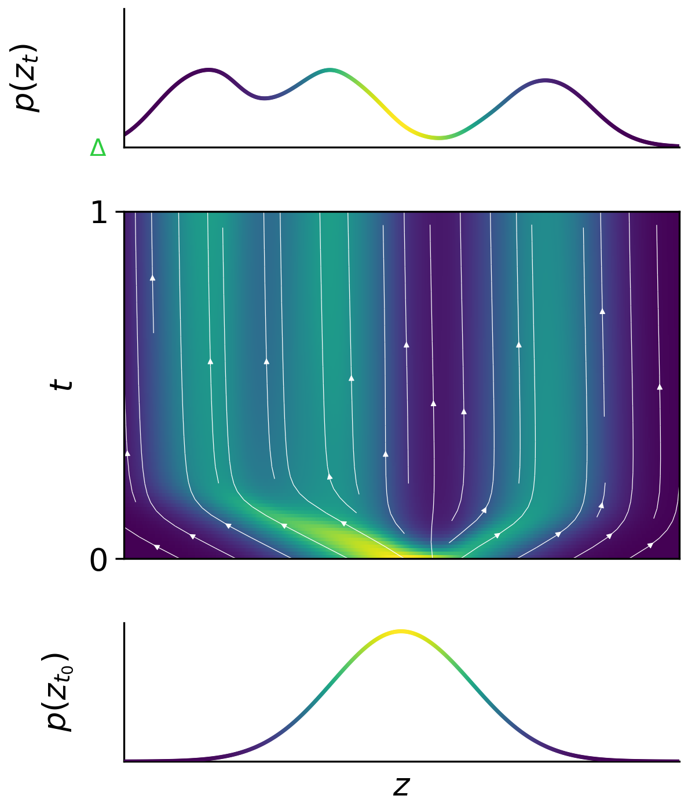
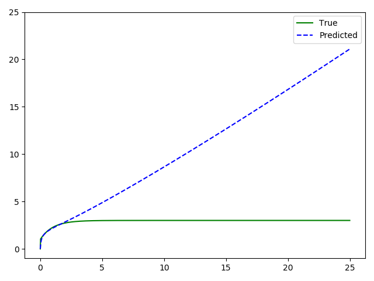
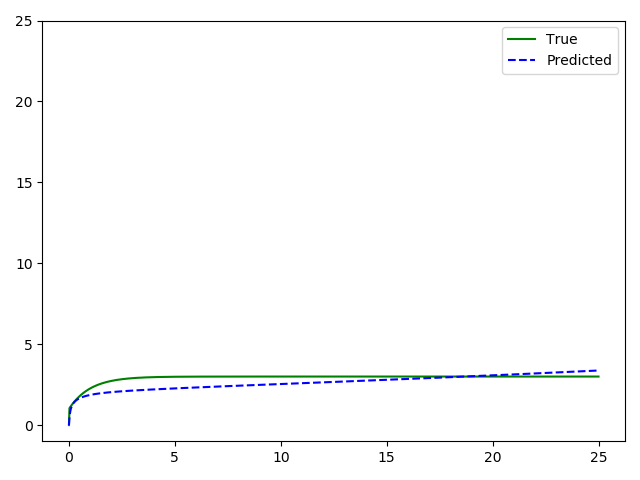

<br>

# STEER Regularization

Installing the steer version of torchdiffeq :

## Prerequisites
- Linux or macOS
- Python 3
- CPU or NVIDIA GPU + CUDA CuDNN

## Install the bundled version of torchdiffeq

```
cd torchdiffeq
python setup.py clean
python setup.py build
python setup.py install
```



<br>

## STEER: Stiff ODE Experiments

Steer version

```
cd stiff_ode_experiments
python stiff_ode_demo.py --viz --data_size 120 --version steer --min_length 0.001 --stiffness_ratio 1000 --niters 3000
```

Standard Neural ODE version

```
cd stiff_ode_experiments
python stiff_ode_demo.py --viz --data_size 120 --version standard --stiffness_ratio 1000 --niters 3000
```

Gaussian version

```
cd stiff_ode_experiments
python stiff_ode_demo.py --viz --data_size 120 --adjoint --version steer --normal_std 0.124 --stiffness_ratio 1000 --niters 3000
```

## STEER: Latent ODE Experiments
MuJoCo Experiment
```
cd latent_ode
python run_models.py --niters 300 -n 10000 -l 15 --dataset hopper --latent-ode --rec-dims 30 --gru-units 100 --units 300 --gen-layers 3 --rec-layers 3
```

Physionet
```
cd latent_ode
python run_models.py --niters 100 -n 8000 -l 20 --dataset physionet --latent-ode --rec-dims 40 --rec-layers 3 --gen-layers 3 --units 50 --gru-units 50 --quantization 0.016 --classif
```

Human Activity
```
cd latent_ode
python run_models.py --niters 200 -n 10000 -l 15 --dataset activity --latent-ode --rec-dims 100 --rec-layers 4 --gen-layers 2 --units 500 --gru-units 50 --classif  --linear-classif
```

## FFJORD: CNF experiments
```
cd ffjord/diagnostics
python approx_error_1d.py --time_length 1
python fig_1_1d_toy.py --save experiments/approx_error_1d --resume experiments/approx_error_1d
```
